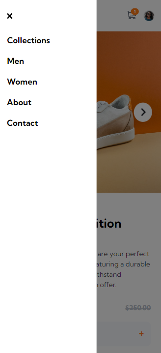

# E-commerce product page

This is a solution to the [E-commerce product page challenge on Frontend Mentor](https://www.frontendmentor.io/challenges/ecommerce-product-page-UPsZ9MJp6). 

## Overview

### The challenge

Users should be able to:

- View the optimal layout for the site depending on their device's screen size
- See hover states for all interactive elements on the page
- Open a lightbox gallery by clicking on the large product image
- Switch the large product image by clicking on the small thumbnail images
- Add items to the cart
- View the cart and remove items from it

### Screenshot

  
  
  
  
  

### Links

- Solution URL: [https://e-commerce-maxdobisz.vercel.app/](https://e-commerce-maxdobisz.vercel.app/)
- Live Site URL: [https://e-commerce-maxdobisz.vercel.app/](https://e-commerce-maxdobisz.vercel.app/)

## My process
The design consisted of a mobile and a desktop view. I implemented a responsive design using a single breakpoint following the design at a minimum width of 769px. In general, I prefer to use more breakpoints for a better visual appearance on different screen sizes.

For styling, I utilized React's styled components library, which offers a wide range of possibilities for larger projects. CSS properties were organized alphabetically, and I followed the BEM methodology for naming classes.

I plan to enhance the project by adding more image sizes to better adapt to various screen sizes and some extra breakpoints.  Another thing will be incorporating the react-swipeable-views library to enable image swiping on mobile devices.

### Built with
- JavaScript
- [React](https://reactjs.org/)
- [Styled Components](https://styled-components.com/)
- [React uuid](https://www.npmjs.com/package/react-uuid)
- CSS custom properties
- Flexbox
- CSS Grid
- BEM methodology
- Mobile-first workflow

